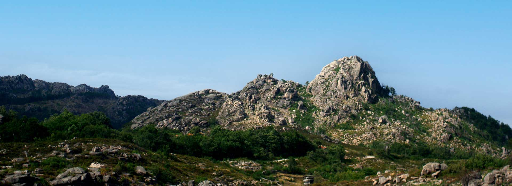
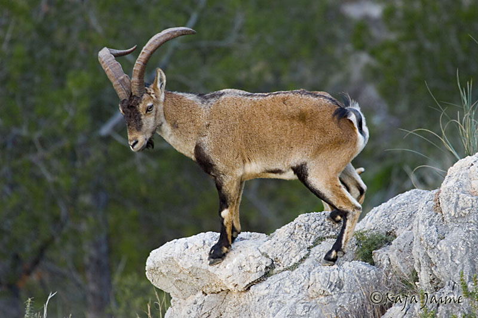
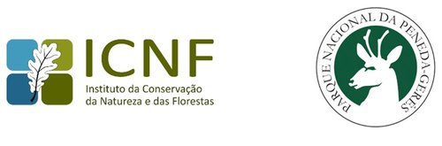

# TPC4 - Afonso Rodrigues, PG55831

## Introdução
Esta página html tem como principal objetivo complicar um conjunto de informações acerca do Parque Nacional da Peneda-Gerês, desde um pouco da sua história, tradições e costumes, e informar acerca dos vários trilhos marcados que existem por todo o parque nacional. 

De notar que esta é uma versão atualizada daquela que foi mostrada em aula, já com algumas ideias concretizadas e quase finalizada como desejaria que fosse. 

## Componentes

## Header

Para os vários títulos, foi usada uma estilização em cor verde escura (característica do parque). Para além disso, o primeiro título foi contralizado. 

```python
<h1 style="color:#006400;" align="center">Parque Nacional Da Peneda-Gerês</h1>     
```

Foi colocada também uma citação referente à Serra do Gerês. Para essa citação, foi utilizado o negrito e o itálico.

```python
 <h4><I>"Há sítios do mundo que são como certas existências humanas: tudo se conjuga para que nada falte à sua grandeza e perfeição. Este Gerês é um deles." - Miguel Torga</I></h4>    
```

De forma a facilitar a chegada ao local/localização do Gerês, mais concretamente da Vila do Gerês, foi colocado um botão que, quando pressionado, nos leva para um separador onde será aberto o Google Maps precisamente no centro da vila.

```python
<p>Como chegar ao Gerês?
                <button onclick="window.location.href='https://www.google.com/maps/place/Parque+Nacional+Peneda-Ger%C3%AAs/@41.7282173,-8.1652066,563m/data=!3m2!1e3!4b1!4m6!3m5!1s0xd256917fd47c523:0x6d193b91beb28db6!8m2!3d41.7282173!4d-8.1626317!16zL20vMDNoN2xt?entry=ttu&g_ep=EgoyMDI1MDMwMy4wIKXMDSoASAFQAw%3D%3D';">Mapa</button></p>
```

Para finalizar o header, foi inserida uma imagem da Serra, seguida de uma introdução acerca desta.



## Body

No body, foi inserido o conjunto de trilhos marcados existentes por todo o parque. Cada um dos trilhos é composto pelo título, texto descritivo, e uma imagem que, quando clicada, abre num novo separador uma página oficial do PNPG com todas as informações acerca do trilho em questão.

Além disso, foi criado um dicionário de termos característicos desta Serra (desde expressões até fauna e flora) para que, nos vários parágrafos, seja possível percebermos melhor o que significam alguns destes conceitos. Quando passamos o cursor por uma das palavras a negrito, aparecerá uma descrição desta.


# Exemplo de trilho:
```python
<h3 style="color:#006400;">Percurso da cabra-montês</h3>
                                <a href="https://natural.pt/protected-areas/parque-nacional-peneda-geres/pathways/percurso-cabra-montes?locale=pt" target="_blank">
                                    
                                </a>

                                <p>No Parque Nacional da Peneda-Gerês, esta pequena rota, de interesse natural e paisagístico, tem o observatório da cabra-montês como principal ponto de interesse.
                                Depois de uma ausência de mais de um século, em 1998/9, a cabra-montês voltou a ocupar o território do Parque Nacional da Peneda-Gerês. Desde então, a sua população tem vindo a crescer e a expandir-se por toda a zona fronteiriça do parque.
                                Em Portugal, a cabra-montês existe apenas no Parque Nacional da Peneda-Gerês, resultado da libertação e fuga acidental de indivíduos em cercados em Espanha, pelo que este percurso oferece-lhe a possibilidade de observar este belo animal selvagem no seu habitat natural, a partir de um local (observatório) estabelecido para que as atividades de visitação se realizem sem prejuízo dos valores naturais presentes e respeitando as práticas tradicionais da comunidade local.
                                Trata-se de uma espécie endémica da Península Ibérica (ou seja apenas aqui existe), que tem a categoria de Quase Ameaçada. Após a extinção da Capra pyrenaica lusitanica no século XIX, desde 1999,  a subespécie que ocorre em Portugal é a Capra pyrenaica victoriae. 
                                É uma espécie gregária que, geralmente e na maior parte do ano, forma grupos do mesmo sexo. Na época de reprodução (finais do outono e inícios do inverno), os grupos juntam-se. A fêmea pode pesar entre 30 kg a 40 kg e ter 0,9 m a 1,3 m, sendo o macho maior entre 1 m a 1,5 m e 50 kg a 90 kg. Porém, em média, as fêmeas vivem mais tempo (até aos 22 anos), enquanto os machos se ficam pelos 15 anos. Têm, por norma, apenas uma cria por parto/ano e a gestação dura cerca de 5 meses. A maturidade sexual é atingida entre os 1,5 anos e os 3 anos, dependendo das condições do animal e recursos existentes. A sua dieta é variada (ervas, folhas de árvores...), adaptando-se aos recursos disponíveis. 
                                Em 2022, estimava-se que, do lado português, a população rondasse os 1.000 indivíduos maturos. Como se trata de uma população que resultou de um pequeno número inicial de indivíduos, tem pouca variedade genética, o que lhe confere alguma fragilidade.</p>
```

## Footer

No footer, temos um conjunto de contactos úteis para quem pensa em visitar a Serra, desde contactos informativos, como o PNPG ou o ICNF, até contactos de emergência como o Número Europeu de Emergência e o SEPNA

Para finalizar, foi colocada uma imagem com os logotipos do PNPG e do ICNF.

```python
<h4 style="color:#006400;" >Contactos úteis:</h4>
                    <p>INCF: 211 507 900</p>
                    <p>Número Europeu de Emergência: 112</p>
                    <p>SEPNA: 217 503 080</p>
                    <p>PNPG: 253 203 480</p>
                    
```


