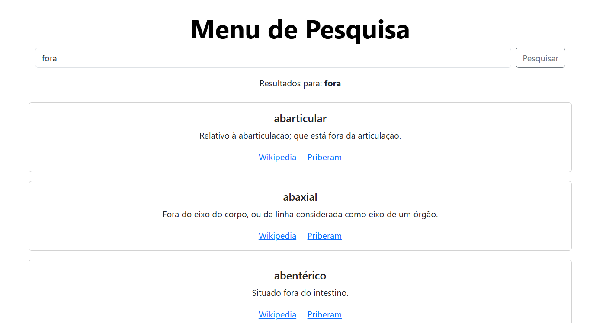

# TPC6 - Afonso Rodrigues, PG55831

## Introdução

Este trabalho de casa tem como objetivo a criação de um menu de pesquisa (dentro do site iniciado nas aulas anteriores), em que o objetivo é que, a partir da pesquisa por um determinado tema, seja retornado o conjunto de conceitos que contém especificamente o termo pesquisado, quer seja na sua designação ou descrição.

Para a realização deste trabalho, foi utilizado como auxílio o DeepSeek.

## pesquisar.html

O ficheiro pesquisar.html é o responsável pela idealização da página de pesquisa por termo. Tem uma barra de pesquisa onde o termo é colocado e, após carregar no botão "Pesquisar", caso o termo esteja presente em algum par designação/descrição da base de dados, irá aparecer um conjunto de "cards" com essa informação, acompanhada de 2 links que redirecionarão para a página de Wikipédia e Priberam da designação. Caso o termo não esteja presente na base de dados, aparecerá uma mensagem indicando que não há resultados disponveis para o termo pesquisado.



## @app.route("/pesquisar", methods=["GET"])
 Aqui, é criada a rota para a página pesquisar.html. O processamento do termo é feito e, caso este esteja presente da forma acima explicada, há um return de toda essa informação. O método utilizado é o "GET".

```python
 @app.route("/pesquisar", methods=["GET"])
def pesquisar():
    termo = request.args.get("termo", "").strip()
    resultados = []
    if termo:
        # Filtra o dicionário para encontrar ocorrências no termo ou na descrição
        for chave, valor in db.items():
            if termo == chave.lower() or termo in valor.lower().split():
                resultados.append({"termo": chave, "descricao": valor})

    return render_template("pesquisar.html", resultados=resultados, termo_pesquisado=termo)
```
