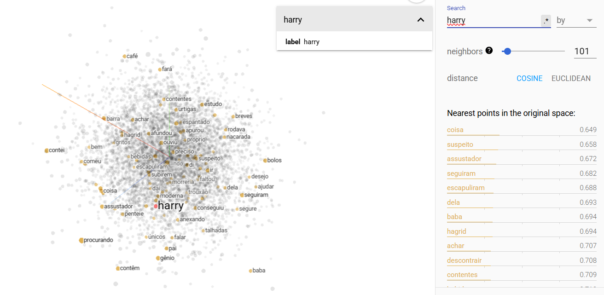

# TPC9 - Afonso Rodrigues, PG55831

## Introdução

Este trabalho tem como principal objetivo a análise do texto de um livro do Harry Potter, pela comparação e várias relações de similaridade entre as palavras do livro.

## Treino do Modelo

## Saving and Coding

## Similaridade

## Intruso

## Analogias

## Tensorflow - nuvem de conceitos

